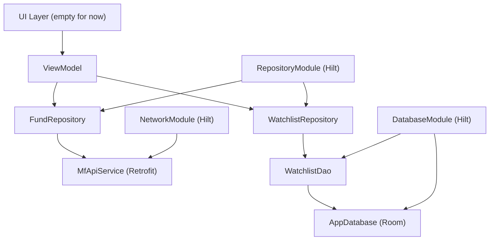

<!--firebender-plan
name: MutualFundApp Phase 1-3
overview: Set up the full data/domain/DI backend for the Mutual Fund app across Phases 1–3: architecture scaffolding, Retrofit API layer, and Room watchlist database — no UI code.
todos:
  - id: phase1-app
    content: "Create MutualFundApp Application class with @HiltAndroidApp and update AndroidManifest.xml"
  - id: phase2-models
    content: "Create domain models: Fund, FundDetails (with FundMeta + NavEntry)"
  - id: phase2-api
    content: "Create MfApiService Retrofit interface"
  - id: phase2-network-module
    content: "Create NetworkModule Hilt module (OkHttpClient + Retrofit + MfApiService) and add logging-interceptor to build.gradle.kts"
  - id: phase3-entities
    content: "Create Room entities: WatchlistFolder and WatchlistFund"
  - id: phase3-dao
    content: "Create WatchlistDao with all required methods"
  - id: phase3-database
    content: "Create AppDatabase RoomDatabase class"
  - id: phase3-di
    content: "Create DatabaseModule and RepositoryModule Hilt modules"
  - id: phase3-repositories
    content: "Create FundRepository and WatchlistRepository"
-->

# MutualFundApp: Phases 1–3 Implementation

## Package root
`com.deysdeveloper.mutualfundapp` inside `app/src/main/java/`

## Architecture Diagram



---

## Phase 1 — Architecture Setup

**New files:**
- `MutualFundApp.kt` — `@HiltAndroidApp` Application class
- `AndroidManifest.xml` — add `android:name=".MutualFundApp"` to `<application>`

**Folder structure created (by new files):**
```
com.deysdeveloper.mutualfundapp/
├── data/
│   ├── api/
│   ├── local/
│   │   ├── dao/
│   │   └── entity/
│   └── repository/
├── di/
├── domain/
│   └── model/
└── ui/  (existing, untouched)
```

---

## Phase 2 — API Integration

**Base URL:** `https://api.mfapi.in/`

**New files:**
- `domain/model/Fund.kt` — `data class Fund(schemeCode: Int, schemeName: String)` with `@SerializedName`
- `domain/model/FundDetails.kt` — `FundDetailsResponse(meta, data, status)` + `FundMeta` + `NavEntry(date, nav)`
- `data/api/MfApiService.kt` — Retrofit interface with `searchFunds(q)` and `getFundDetails(schemeCode)`
- `di/NetworkModule.kt` — `@Module @InstallIn(SingletonComponent)` providing `OkHttpClient`, `Retrofit`, `MfApiService`
- `app/build.gradle.kts` — add `okhttp3:logging-interceptor` dependency

**API endpoints:**
- `GET /mf/search?q={query}` → `List<Fund>`
- `GET /mf/{schemeCode}` → `FundDetailsResponse`

---

## Phase 3 — Room Database + Repositories

**New files:**
- `data/local/entity/WatchlistFolder.kt` — `@Entity` with `id` (PK autoGenerate), `name`
- `data/local/entity/WatchlistFund.kt` — `@Entity` with `id` (PK), `schemeCode`, `folderId` (FK)
- `data/local/dao/WatchlistDao.kt` — `@Dao` with insert/query/check methods, `Flow` for reads
- `data/local/AppDatabase.kt` — `@Database(entities=[...])` RoomDatabase
- `di/DatabaseModule.kt` — provides `AppDatabase` and `WatchlistDao`
- `di/RepositoryModule.kt` — provides `FundRepository` and `WatchlistRepository`
- `data/repository/FundRepository.kt` — wraps `MfApiService`; `suspend` functions
- `data/repository/WatchlistRepository.kt` — wraps `WatchlistDao`; `Flow` for reads, `suspend` for writes

---

## Files to modify
- `AndroidManifest.xml` — add `android:name`
- `app/build.gradle.kts` — add logging interceptor dependency

## Files to create (13 total)
- `MutualFundApp.kt`
- `domain/model/Fund.kt`
- `domain/model/FundDetails.kt`
- `data/api/MfApiService.kt`
- `di/NetworkModule.kt`
- `data/local/entity/WatchlistFolder.kt`
- `data/local/entity/WatchlistFund.kt`
- `data/local/dao/WatchlistDao.kt`
- `data/local/AppDatabase.kt`
- `di/DatabaseModule.kt`
- `data/repository/FundRepository.kt`
- `data/repository/WatchlistRepository.kt`
- `di/RepositoryModule.kt`
