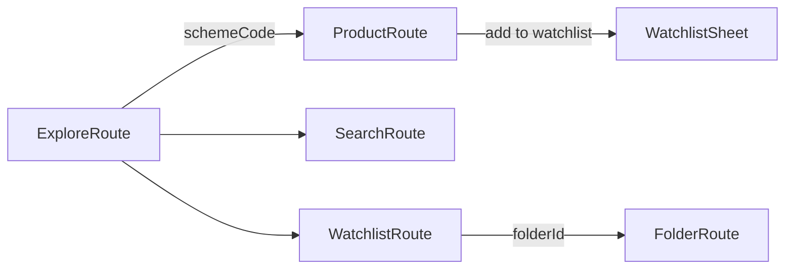

<!--firebender-plan
name: MutualFundApp Phase 4-8
overview: Implement the full UI layer (Phases 4–8) for the Mutual Fund app — Explore, Product, Watchlist, Search screens with ViewModels using StateFlow, MPAndroidChart for NAV chart, and Navigation 3 (androidx.navigation3) for routing.
todos:
  - id: gradle-nav3
    content: "Add Navigation 3, serialization plugin, hilt-navigation-compose, and coroutines-core dependencies to build.gradle.kts and libs.versions.toml"
  - id: nav-routes
    content: "Create NavRoutes.kt with all @Serializable route keys"
  - id: nav-display
    content: "Create AppNavigation.kt with NavDisplay, back stack, and bottom nav bar"
  - id: main-activity
    content: "Update MainActivity.kt with @AndroidEntryPoint and AppNavigation()"
  - id: explore-vm
    content: "Create ExploreViewModel with parallel category fetching and ExploreUiState"
  - id: explore-screen
    content: "Create ExploreScreen with LazyColumn category sections and fund cards"
  - id: product-vm
    content: "Create ProductViewModel with fund details fetch, NAV downsampling, and watchlist state"
  - id: product-screen
    content: "Create ProductScreen with fund info, MPAndroidChart LineChart wrapped in AndroidView, watchlist icon"
  - id: watchlist-sheet
    content: "Create WatchlistBottomSheet with folder multi-select checkboxes and new folder creation"
  - id: watchlist-vm
    content: "Create WatchlistViewModel managing folders Flow, createFolder(), saveFundToFolders()"
  - id: watchlist-screens
    content: "Create WatchlistScreen (folder list + empty state) and FolderDetailScreen (fund list + empty state)"
  - id: search-vm
    content: "Create SearchViewModel with debounced query StateFlow pipeline"
  - id: search-screen
    content: "Create SearchScreen with search bar and LazyColumn results"
-->

# MutualFundApp: Phases 4–8 UI Layer

## Dependency additions (build.gradle.kts + libs.versions.toml)
- `androidx.navigation3:navigation3-runtime:1.0.0`
- `androidx.navigation3:navigation3-ui:1.0.0`
- `androidx.hilt:hilt-navigation-compose:1.2.0` (for `hiltViewModel()` in Nav3 entries)
- `org.jetbrains.kotlinx:kotlinx-serialization-json:1.6.3` (required for `@Serializable` route keys)
- Add `kotlin-serialization` plugin to both `libs.versions.toml` and `build.gradle.kts`
- Also add `kotlinx-coroutines-core` if not already present (for `debounce`)

## Navigation 3 Architecture
Route keys are `@Serializable` data objects/classes. Back stack is managed via `rememberNavBackStack`. Rendering via `NavDisplay`.



## Route definitions (NavRoutes.kt)
- `ExploreRoute` — data object
- `ProductRoute(schemeCode: String)` — data class
- `WatchlistRoute` — data object
- `FolderRoute(folderId: Long)` — data class
- `SearchRoute` — data object

## UI State pattern (applied to all screens)
```
sealed class XxxUiState {
    object Loading
    data class Success(...)
    data class Error(message: String)
}
```

---

## Phase 4 — Explore Screen
**Files:**
- `ui/explore/ExploreViewModel.kt` — fetches 4 categories in parallel (`async`), emits `ExploreUiState`
- `ui/explore/ExploreScreen.kt` — `LazyColumn` with per-category horizontal `LazyRow` (4 fund cards max), fund card showing name + latest NAV

## Phase 5 — Product Screen
**Files:**
- `ui/product/ProductViewModel.kt` — fetches `FundDetailsResponse`, checks watchlist state, exposes `ProductUiState`
- `ui/product/ProductScreen.kt` — AMC name, scheme type, latest NAV, MPAndroidChart `LineChart` wrapped in `AndroidView`, watchlist toggle icon

NAV data optimization: take last 365 entries, then downsample every 10th entry for chart performance.

## Phase 6 — Watchlist Bottom Sheet
**Files:**
- `ui/product/WatchlistBottomSheet.kt` — `ModalBottomSheet` with folder checkbox list, "Create New Folder" TextField + Button; on confirm calls `WatchlistViewModel.saveFundToFolders()`
- `ui/watchlist/WatchlistViewModel.kt` — manages folders (`Flow<List<WatchlistFolder>>`), `createFolder()`, `saveFundToFolders(schemeCode, folderIds)`; used from both ProductScreen and WatchlistScreen

## Phase 7 — Watchlist Screen + Folder Detail
**Files:**
- `ui/watchlist/WatchlistScreen.kt` — folder list with empty-state illustration; each folder item navigates to `FolderRoute`
- `ui/watchlist/FolderDetailScreen.kt` — fund list within a folder, empty-state when no funds

## Phase 8 — Search Screen
**Files:**
- `ui/search/SearchViewModel.kt` — `MutableStateFlow<String>` for query, `debounce(300ms)` + `distinctUntilChanged()` pipeline calling `FundRepository.searchFunds()`, exposes `SearchUiState`
- `ui/search/SearchScreen.kt` — search bar + `LazyColumn` results; `Loading`, `Success`, `Empty`, `Error` states

## Navigation wiring
**Files:**
- `ui/navigation/NavRoutes.kt` — all `@Serializable` route key definitions
- `ui/navigation/AppNavigation.kt` — `NavDisplay` with `rememberNavBackStack(ExploreRoute)`, `entryProvider { entry<T> { ... } }` for all 5 routes; bottom nav bar (Explore / Search / Watchlist)
- `MainActivity.kt` — updated with `@AndroidEntryPoint`, sets `AppNavigation()` as content

---

## Files summary
- **Modified (3):** `MainActivity.kt`, `build.gradle.kts`, `libs.versions.toml`
- **New (13):**
  - `ui/navigation/NavRoutes.kt`
  - `ui/navigation/AppNavigation.kt`
  - `ui/explore/ExploreViewModel.kt`
  - `ui/explore/ExploreScreen.kt`
  - `ui/product/ProductViewModel.kt`
  - `ui/product/ProductScreen.kt`
  - `ui/product/WatchlistBottomSheet.kt`
  - `ui/watchlist/WatchlistViewModel.kt`
  - `ui/watchlist/WatchlistScreen.kt`
  - `ui/watchlist/FolderDetailScreen.kt`
  - `ui/search/SearchViewModel.kt`
  - `ui/search/SearchScreen.kt`
