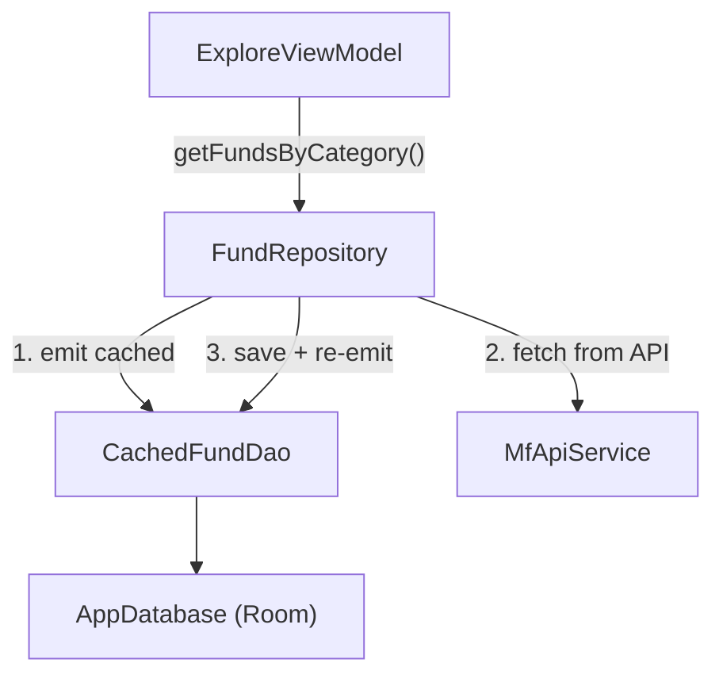

<!--firebender-plan
name: Phases 7-8-9 Implementation
overview: Phases 7 and 8 are already fully implemented. The primary work is Phase 9: adding a `CachedFund` Room entity + DAO, updating `FundRepository` with offline-first cache logic, and refactoring `ExploreViewModel` to use a Flow-based approach so Explore works offline.
todos:
  - id: cached-fund-entity
    content: "Create CachedFund Room entity"
  - id: cached-fund-dao
    content: "Create CachedFundDao with insert, delete, and getFundsByCategory"
  - id: app-database
    content: "Update AppDatabase to include CachedFund entity and bump version to 2"
  - id: database-module
    content: "Update DatabaseModule to provide CachedFundDao and add fallbackToDestructiveMigration"
  - id: fund-repository
    content: "Inject CachedFundDao into FundRepository and implement getFundsByCategory Flow with cache-first logic"
  - id: repository-module
    content: "Update RepositoryModule to inject CachedFundDao into FundRepository"
  - id: explore-viewmodel
    content: "Refactor ExploreViewModel to collect per-category Flows and update state incrementally"
-->

# Phases 7, 8, 9 — Mutual Fund App

## Status Check

- **Phase 7 (Watchlist)** — Already complete. `WatchlistScreen.kt`, `FolderDetailScreen.kt`, and `WatchlistViewModel.kt` all match spec requirements (LazyColumn, empty states, navigation).
- **Phase 8 (Search)** — Already complete. `SearchViewModel.kt` uses debounce(300ms) + distinctUntilChanged + collectLatest; `SearchScreen.kt` handles all states (idle, loading, results, empty, error).
- **Phase 9 (Caching)** — Not yet implemented. Full implementation required.

---

## Phase 9: Offline-First Caching for Explore

### Architecture Flow

---

### New Files to Create

**`data/local/entity/CachedFund.kt`**
- `@Entity(tableName = "cached_funds")`
- Fields: `id: Long` (PK, autoGenerate), `category: String`, `schemeCode: String`, `fundName: String`, `nav: String`

**`data/local/dao/CachedFundDao.kt`**
- `@Insert(onConflict = OnConflictStrategy.REPLACE)` — `insertFunds(funds: List<CachedFund>)`
- `@Query("DELETE FROM cached_funds WHERE category = :category")` — `deleteFundsByCategory(category: String)`
- `@Query("SELECT * FROM cached_funds WHERE category = :category")` — `getFundsByCategory(category: String): Flow<List<CachedFund>>`

---

### Files to Modify

**`data/local/AppDatabase.kt`**
- Add `CachedFund::class` to `entities`
- Bump `version` from `1` to `2`
- Add `.fallbackToDestructiveMigration()` in `DatabaseModule` (dev app, no user data in cache table)

**`di/DatabaseModule.kt`**
- Add `@Provides @Singleton fun provideCachedFundDao(db: AppDatabase): CachedFundDao`

**`data/repository/FundRepository.kt`**
- Inject `CachedFundDao` (update constructor)
- Add `getFundsByCategory(category: String): Flow<List<Fund>>`:
  - Emit cached data from Room immediately (mapped `CachedFund → Fund`)
  - In the same flow, fetch from API → delete old cache → insert fresh → Room Flow auto-emits updated list
  - On network error, swallow exception (cached data already emitted)

**`di/RepositoryModule.kt`**
- Pass `CachedFundDao` into `FundRepository` provider

**`ui/explore/ExploreViewModel.kt`**
- Replace the concurrent `async { searchFunds(query) }` approach with per-category Flow collection
- Launch a coroutine per category that collects `fundRepository.getFundsByCategory(query)` and updates a shared `MutableStateFlow<Map<String, List<Fund>>>`
- Expose `ExploreUiState.Success` as soon as any category emits (cached or fresh)
