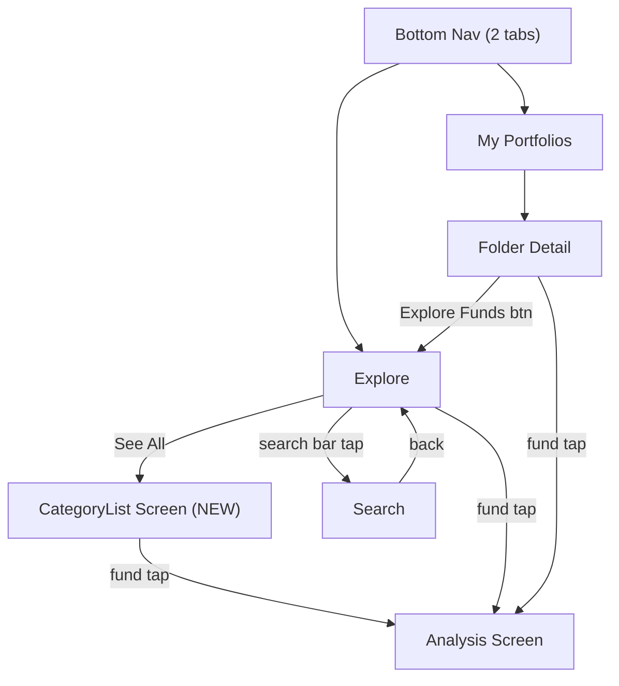

<!--firebender-plan
name: Wireframe Alignment
overview: Update the app to match the wireframe: remove Search from bottom nav (2 tabs only), add a Category List screen wired to "See All", rename Watchlist to "My Portfolios", add an "Explore Funds" CTA to the empty folder state, and polish the Product/Analysis screen.
todos:
  - id: nav-routes
    content: "Add Route.CategoryList to NavRoutes.kt"
  - id: app-navigation
    content: "Remove Search from bottom nav, add CategoryList entry, pass onNavigateToExplore to FolderDetailScreen"
  - id: category-viewmodel
    content: "Create CategoryListViewModel using SavedStateHandle + fundRepository.getFundsByCategory"
  - id: category-screen
    content: "Create CategoryListScreen with TopAppBar, LazyColumn fund rows, loading/empty states"
  - id: explore-see-all
    content: "Wire 'See All' click in ExploreScreen to onNavigateToCategory callback"
  - id: watchlist-rename
    content: "Rename 'My Watchlist' to 'My Portfolios' in WatchlistScreen and bottom nav label"
  - id: folder-empty-state
    content: "Add Explore Funds button and updated text to FolderDetailScreen empty state"
  - id: product-polish
    content: "Rename title to Analysis, add NAV change %, time filter tabs (6M/1Y/ALL), and stats row"
-->

# Wireframe Alignment Plan

## Change Summary

---

## 1. Navigation — Remove Search Tab, Add CategoryList Route

**`ui/navigation/NavRoutes.kt`**
- Add `data class CategoryList(val categoryLabel: String, val query: String) : Route`

**`ui/navigation/AppNavigation.kt`**
- Remove `Route.Search` from `navItems` list (keep only Explore + Watchlist)
- Update `selectedRootRoute` filter to remove `Route.Search` check
- Add `entry<Route.CategoryList>` wiring `CategoryListScreen`
- Pass `onNavigateToExplore` into `FolderDetailScreen` entry: clears stack and pushes `Route.Explore`

---

## 2. New Screen — Category List ("All Funds")

**`ui/explore/CategoryListViewModel.kt`** (new)
- `@HiltViewModel` with `SavedStateHandle` to read `query`
- Calls `fundRepository.getFundsByCategory(query)` (cache-first, same flow as Explore)
- Exposes `StateFlow<List<Fund>>`

**`ui/explore/CategoryListScreen.kt`** (new)
- `TopAppBar` with back arrow + `categoryLabel` as title
- `LazyColumn` of fund rows (AMC circle badge, fund name, scheme code)
- Loading and empty states
- Each row navigates to Product on tap

---

## 3. Explore Screen — Wire "See All"

**`ui/explore/ExploreScreen.kt`**
- Add `onNavigateToCategory: (label: String, query: String) -> Unit` param
- Wire `CategorySection` "See All" click to this callback (currently a no-op)
- Pass corresponding `EXPLORE_CATEGORIES` entry value as `query`

---

## 4. Watchlist — Rename to "My Portfolios"

**`ui/watchlist/WatchlistScreen.kt`**
- `TopAppBar` title: `"My Watchlist"` → `"My Portfolios"`
- Bottom nav label in `AppNavigation`: `"Watchlist"` → `"Portfolios"`

---

## 5. Folder Detail — Add "Explore Funds" Empty State Button

**`ui/watchlist/FolderDetailScreen.kt`**
- Add `onNavigateToExplore: () -> Unit` param
- In `FolderEmptyState`: add a `Button("Explore Funds")` that calls this callback
- Update text: `"No funds added yet."` / `"Explore the market to save funds into this portfolio."`

---

## 6. Product Screen — Polish to Match "Analysis" Wireframe

**`ui/product/ProductScreen.kt`**
- `TopAppBar` title: `"Fund Details"` → `"Analysis"`
- Add NAV change % badge (compute from first two entries in `fundDetails.data`)
- Add time-filter tab row (`6M | 1Y | ALL`) that trims the chart data by date range
- Add stats row at bottom: `Type | Category | Latest NAV` (from `FundMeta`)
